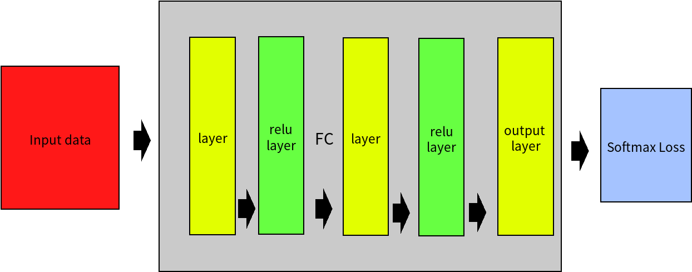

# DNN
## Introduction
This is a DNN implementation without using any framework(e.g. tensorflow, keras).
It uses SGD optimization.The data it supported is only Cifar10.if you want use other data set, you can write the load way by yourself.
1. Can specify the numbers and size of the hidden layers.
2. Use the method **tuning\_hyperparameter** to get the best hyperparameter
3. Visulize the weight and data
### If you want to know more how to use, you can check the `DNN_example.ipynb` file
## Architecture

## Instruction
```
curl -O https://www.cs.toronto.edu/~kriz/cifar-10-python.tar.gz
tar zxvf cifar-10-python.tar.gz
pip3 install -r requirements.txt
```
