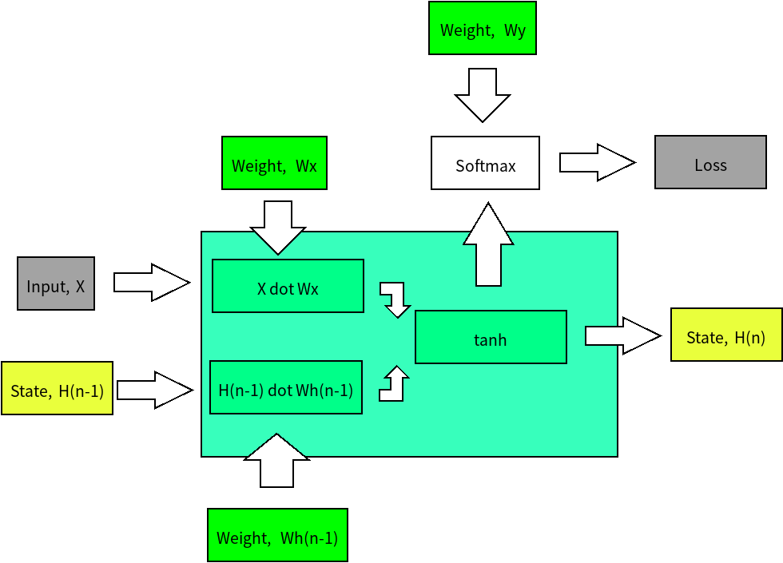

# RNN
## Introduction
This is the simple RNN implementation without using any framework(ex. tensorflow, keras, pytorch).It uses SGD optimization.You can use the input file I provided, or just put any content in input.txt file.
Be aware that this is just a simple RNN, it cannot afford too much(and too complex) input.

## Architecture


## Instruction
```
pip3 install numpy
python3 RNN.py
```
